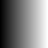
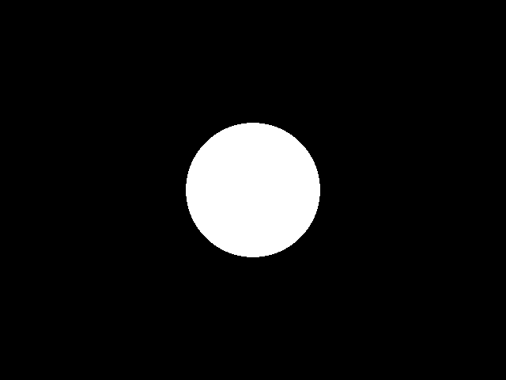

# Introduction

$$x+y$$

This tutorial is meant to walk the reader iteratively through
programming a basic ray caster, ray marcher, ray tracer, and path tracer
at a beginner level. The emphasis will be on simplicity, clarity, and
completeness (as far as the beginner level constraint allows), rather
than on performance and innovation. The goal is to incrementally extend
the knowledge of the reader, mainly following the historical development
of the field (sphere tracing and ray marching being an exception). This
means that we will start all the way back with Appel’s work on ray
casting from 1968, take a detour to Hart’s paper on sphere tracing from
1996, proceed through with Whitted’s work on ray tracing from 1979,
continue with Cook et al.’s distributed ray tracing from 1984, and
finally end our journey with Kajiya’s seminal work on the rendering
equation and path tracing from 1986. Other articles and papers would be
referenced also, but the ones listed would form the cornerstones for
this tutorial. The order is chosen to be conceptually consistent and to
follow the increase in complexity of the ideas in the field.

The tutorial comes paired with an example implementation in C++ of the
discussed ideas and techniques. The reader should ideally refer to the
code for anything missing in this document and vice versa.

The code evolution is named to parallel stellar evolution, which should
be a hint for the reader as to where this journey may end depending on
how motivated and interested in the topic he is. This is also probably
the moment to mention that I take no responsibility for the illegal
amounts of fun that readers may experience while implementing the ideas
discussed by themselves, and for the proportional amount of time that
will somehow magically disappear from their schedules.

# Ray casting

All the way back in 1968 Arthur Appel introduced ray casting to computer
graphics - the presented paper included point lights, diffuse
illumination and sharp shadows. And while some of the issues were vastly
different - such as what symbols to pick to shade an image (plus signs
were used in his paper), others are still relevant - namely
computational efficiency. Consider the fact that at the time of writing
this tutorial, rasterization graphics still have to fake shadows due to
efficiency considerations - something Appel was rendering back in 1968.

Topics that will be covered in this section include: outputting an image
in a very simple format (PPM), creating a basic camera, intersecting
collections of primitives, basic shading, and sampling.

## Prerequisites

The reader is expected to have some fundamental programming skills as
well as have some basic knowledge in linear algebra and analytic
geometry. The code throughout this tutorial will be in C++, and while we
will intentionally avoid more complex programming topics, we will still
use convenient tools like polymorphism to simplify our implementation
(while possibly ruining performance). Still, the focus will be on
simplicity and clarity rather than performance. The mathematical
knowledge required includes: the notion of 3-dimensional vectors, the
dot product, the cross product, and solving quadratic equations. While
additional knowledge may help to appreciate some ideas better, it is not
required, and proofs that go outside of this scope may be skipped (they
are provided only for completeness - for readers that want a little
more, however, they should be aware that there are resources which are
many times better in this regard). Additional proofs/derivations can be
found in appendix A at the end of the tutorial.

## Ray tracing a sphere

In this section we aim to set the fundamentals on which the later parts
will build on. It is crucial that the reader understands most if not all
of the things discussed in this subsection. The end result of what seems
like a lot of work will be a rather unimpressive flat rendering of a
sphere. However, all that effort will pay off in the later parts, when
we have the technicalities out of the way and can focus on more
interesting aspects such as shading. Readers familiar with the basics
should feel free to skim through or skip this part.

### A simple 3D vector library

Throughout the rest of the tutorial performing operations with 3D
vectors will be commonplace. And while it is possible to type those out
for each component every time they arise, it is neither practical nor
efficient, so we will make a slight detour to build a very simple 3D
vector library. The structure representing our 3-dimensional vector,
that we will refer to as *vec3*, will be made of 3 primary floating
point fields: *x,y,z*, and various aliases of those. If we have a vector
\(\vec{v}\) we will use the notation \(v_0,v_1,v_2\) for its first,
second, and third component respectively, alternatively
\(v(0),v(1),v(2)\), or \(v=(v_1,v_2,v_3)\). We define the componentwise
operations of addition (\(+\)), subtraction (\(-\)), multiplication
(\(\cdot\)), and division (\(/\)) on pairs of vectors
\(\vec{u},\vec{v}\) respectively as:
\[\vec{u} + \vec{v} \coloneqq (u_0 + v_0, u_1 + v_1, u_2 + v_2)\]
\[\vec{u} - \vec{v} \coloneqq (u_0 - v_0, u_1 - v_1, u_2 - v_2)\]
\[\vec{u} \cdot \vec{v} \coloneqq (u_0v_0, u_1v_1, u_2v_2)\]
\[\frac{\vec{u}}{\vec{v}} \coloneqq (\frac{u_0}{v_0}, \frac{u_1}{v_1}, \frac{u_2}{v_2})\]

We additionally define multiplication and division with a scalar:
\[\vec{u} \cdot s \coloneqq (u_0s, u_1s, u_2s)\]
\[\frac{\vec{u}}{s} \coloneqq (\frac{u_0}{s}, \frac{u_1}{s},\frac{u_2}{s})\]

Finally we define the dot and cross product as:
\[\langle \vec{u}, \vec{v} \rangle \coloneqq u_0v_0 + u_1v_1 + u_2v_2\]
\[\vec{u} \times \vec{v} \coloneqq (u_1v_2-u_2v_1, u_2v_0-u_0v_2, u_0v_1-u_1v_0)\]

The length (magnitude) of a vector \(\vec{v}\) will be denoted as
\(\| \vec{v} \|\), and is computed as:
\[\| \vec{v} \| = \sqrt{\langle \vec{v}, \vec{v} \rangle}\]

We recommend that readers that have never before written a vector class,
take the time to implement the structure and operations defined above as
an exercise, readers that have done this previously should feel free to
use the provided implementation directly. The corresponding reference
code can be found in *vec.h*.

### Image representation and saving as PPM

One can represent rendered images as either *vec3* valued 2D arrays (the
first, second, and third component correspond respectively to red,
green, blue) with dimensions \(width\times height\), or one-dimensional
arrays in row- or column-major order of size \(width\times height\). We
only require a structure that exposes an accessor, which given indices
\((x,y)\) in the range \([0,width)\times[0,height)\) returns the cell at
\((x,y)\). Throughout this tutorial we will use the notation \(A_{x,y}\)
or \(A(x,y)\) for accessing the \((x,y)\) element of an image named
\(A\). In order to save such an image in plain PPM format, we write out
the plain PPM header, which is made up of a magic number describing the
file type *P3*, the width as an integer value, the height as an integer
value, and the maximum color value, which can be at most
\(2^{16}-1 = 65535\), with whitespaces between all of those. An example
of such a header for an image of dimensions \(1024\times 768\), with a
maximum color value of \(2^8-1 = 255\) looks like this:

    P3
    1024 768
    255

After we have written out the header, we can proceed to write out our
image in row-major order:

``` c++
for(int y=0;y<height;++y)
{
    for(int x=0;x<width;++x)
    {
        vec3 clampedColor = 
        clamp(image(x,y) * 256.0, 0.0, 255.0);
        
        file << (int)clampedColor(0) << "\t" 
        << (int)clampedColor(1) << "\t" 
        << (int)clampedColor(2) << "\t\t";
    }
    file << "\n";
}
file.close()
```

The clamp function is analogous to its glsl counterpart and limits the
value to the given range (and is implemented componentwise for a
vector). The clamping is done in order to keep values in the
range\([0,255]\).

Finally, we provide an algorithm to render a horizontal gradient:

``` c++
for(int y=0;y<height;++y)
{
    for(int x=0;x<width;++x)
    {
        image(x,y) = vec3((float)x/(float)(width-1));
    }
}
```

The output for a \(100\times 100\) image is presented below:



A reference implementation of a structure representing an image and a
method to save a PPM file can be found in *image.h*. The readers are
encouraged to modify it or implement their own variant.

### Camera and generating rays

A ray in 3D is defined by its origin \(\vec{0}\) and a direction vector
\(\vec{d}\). All points (the set of points) on the ray are given by
\(\vec{r}(t) = \vec{o}+t\vec{d}, t\geq 0\). We will exclusively use
normalized ray directions (\(\| \vec{d} \|=1\)) since it saves a lot of
trouble down the line normalizing them for shading calculations and this
also makes some intersection calculations easier. Additionally if the
direction vector is normalized, then the point:
\[\vec{r}(t) = \vec{o} + t\vec{d}\] is exactly at distance \(t\) from
\(\vec{o}\), meaning that \(\| \vec{r}(t)-\vec{o} \| = t\), which will
prove useful later on where we get to shading.

We will also define a very simple camera, which given a pixel’s
coordinates \((x,y)\) will generate a ray passing through the center of
said pixel. There are numerous ways to define a camera, but here we
define it by its origin \(\vec{o}\), its right vector \(\vec{e_0}\), its
up vector \(\vec{e_1}\), and its forward vector \(\vec{e_2}\). Initially
those will be set to \((0,0,0)\), \((1,0,0)\), \((0,1,0)\), \((0,0,1)\)
respectively (which makes them orthonormal - orthogonal to each other
and unit length), i.e. the 3 directions will coincide with the \(X,Y,Z\)
axes, and the camera’s origin will be at the origin of the coordinate
system. When we generate a ray, its origin will coincide with the origin
of the camera. Given pixel coordinates
\((x,y) \in [0,width)\times [0,height)\) we will first map those to
\([-r,r]\times [1,-1]\) in order for the central image pixel to be at
\((0,0)\) (which provides a nice symmetry), where
\(r = \frac{width}{height}\) is the aspect ratio. We usually want the
virtual camera film to have the same aspect ratio as our target
resolution as to not stretch out the image, that’s why we have
\([-r,r]\times [1,-1]\) rather than \([-1,1]\times [1,-1]\). The flip of
the \(y\) coordinate (that is using \([1,-1]\) rather than \([-1,1]\))
is done to account for the fact that in pixel coordinates the \(y\)
coordinate increases downwards and not upwards, which is the opposite of
the case for our virtual world where \((0,1,0)\) points up.

Novice readers that are not very comfortable with mathematics should
feel free to skip the derivation below and just use the results from it
readily, even though it boils down to solving linear equations.

We derive the linear mapping from \([0,width)\times[0,height)\) to
\([-r,r]\times [-1,1]\). This is done by finding linear functions:
\(L_x(x) = a_xx+b_x, L_y(y) = a_yy+b_y\), such that \(L_x(0) = -r\),
\(L_x(width) = r\), \(L_x(0) = 1\), \(L_x(height) = -1\).

\[L_x(0) = a_x0 + b_x = b_x = -r\]
\[L_x(width) = a_xwidth + b_x = a_xwidth - r = r \implies a_x = 2\frac{r}{width}\]
\[L_x(x) = \frac{2r}{width}x - r = r\left(\frac{2}{width}x-1\right)\]
\[L_y(0) = a_y0+b_y = b_y = 1\]
\[L_y(height) = a_yheight+b_y = a_yheight+1 = -1 \implies a_y = -\frac{2}{height}\]
\[L_y(y) = -\frac{2}{height}y + 1\]

There’s a final minor detail to account for, which is that \((x,y)\)
really constitutes a pixel’s upper left corner, so an offset by
\((0.5,0.5)\) is necessary for the ray to pass through the center of the
pixel and not the lower left corner of the pixel of the virtual film
(lower and not upper due to the \(y\) flip in virtual 3D space). Thus
the final mapping from pixel coordinates to normalized screen
coordinates is: \[L_x(x) = r\left(\frac{2}{width}(x+0.5)-1\right)\]
\[L_y(y) = -\frac{2}{height}(y+0.5) + 1\]

Finally, to generate the ray direction passing through a given pixel we
use the normalized screen coordinates to pick a point on the virtual
film of the camera:

\[\vec{d} = L_x(x)\vec{e}_0 + L_y(y)\vec{e}_1 + e_2\]

We normalize the direction after that for the reasons outlined in the
beginning of the subsection. A reference implementation for generating a
ray from pixel coordinates can be found below, as well as in *camera.h*
in the accompanying code:

``` c++
float u = (float)width/(float)height * 
(2.0f * ((float)x + 0.5f) / (float)width - 1.0f);
float v = -2.0f * ((float)y + 0.5f) / (float)height + 1.0f;
vec3 rayOrigin = camera.origin;
vec3 rayDirection = normalize(u * camera.e0 + v * camera.e1 + camera.e2);
```

### Sphere intersection

We finally get to the last part of rendering our sphere - actually
defining the intersection of a ray with the sphere, which lies at the
heart of ray casting - finding intersections between rays and geometry.
A sphere is defined mathematically as the set of points that are at the
exact same distance (\(R\) the radius) from a certain point
(\(\vec{c}=(c_x,c_y,c_z)\) the center of the sphere). Thus for a point
\(\vec{p} = (x,y,z)\) lying on the sphere, the following (canonical)
equation holds: \[(x-c_x)^2 + (y-c_y)^2 + (z-c_z)^2 = R^2\] or
equivalently:
\[\| \vec{p}-\vec{c} \|^2 = \langle \vec{p}-\vec{c}, \vec{p}-\vec{c} \rangle = R^2\]
In the previous section we saw that a ray is defined (parametrically)
as: \[\vec{r}(t) = \vec{o} + t\vec{d}\] For a point \(q\) to be in the
intersection of the ray and the sphere, it must satisfy both equations.
We can achieve that by setting \(\vec{p} = \vec{r}(t)\) and solving for
\(t\): \[\langle \vec{r}(t)-\vec{c}, \vec{r}(t)-\vec{c} \rangle = R^2\]
\[\langle \vec{o}+t\vec{d}-\vec{c}, \vec{o}+t\vec{d}-\vec{c} \rangle = R^2\]
\[\langle \vec{d}, \vec{d} \rangle t^2 -2\langle \vec{d}, \vec{c}-\vec{o} \rangle t + \langle \vec{c}-\vec{o}, \vec{c}-\vec{o} \rangle - R^2 = 0\]
\[At^2 - 2Bt + C = 0\]
\[A = \langle \vec{d}, \vec{d} \rangle, B = \langle \vec{d}, \vec{c}-\vec{o} \rangle, C=\langle \vec{c}-\vec{o}, \vec{c}-\vec{o} \rangle - R^2\]
\[D' = 4B^2-4AC = 4(B^2-AC) = 4D\]

In step 3 we have used the linearity of the dot product and its
distributive property. We have a quadratic polynomial with respect to
\(t\) on the left side. The solution for \(t\) is well known (see
appendix subsection
[7.1.1](#appendix:Quadratic%20formula%20derivation)), and is real only
when the discriminant \(D\) satisfies: \(D\geq 0\). If \(D=0\), there is
a single solution for \(t\) corresponding to the ray grazing the sphere
in a single point, if \(D>0\), there are 2 solutions for \(t\)
corresponding to the points where the ray enters the sphere and where it
exits the sphere, if \(D<0\) the ray does not intersect the sphere.
Before we proceed further, we will note that \(A=1\), as long as the ray
direction is normalized, which we stated that we will uphold. Thus we
get the simplified solutions: \[t_1 = B-\sqrt{D}, t_2 = B+\sqrt{D}\]

Note that with the standard formula \(D' = (2B)^2-4AC = 4D\), and
\(\sqrt{D'} = 2\sqrt{D}\), then
\(t_1 = \frac{2B-2\sqrt{D}}{2A} = \frac{B-\sqrt{D}}{A}\) - we arrive at
the simplified solution, since the \(2\) in front of \(B\) cancels out
with the denominator (and \(A=1\)).

The last detail that we are missing, is the fact that \(\vec{r}(t)\) is
part of the ray only for \(t\geq 0\). Thus we should throw away
intersections that do not satisfy this criteria, as they will be
effectively "behind" the ray’s origin.

When tracing the ray through the scene we want to return the first
intersection, as obviously anything behind that would be occluded. In
this case where we have only one sphere, and two possible intersections,
we know which is the closer one: \(t_1\) since we subtract a
non-negative value from \(B\). If the closer intersection is not smaller
than \(0\) then it is in front of the ray, and we should pick it as the
closest one. If it is behind the ray, we can now pick the second
intersection \(t_2\) as long as it is \(>0\). If both are behind the ray
origin (\(t_1<0, t_2<0\)) we treat it as there being no intersections.
We will additionally extend this to arbitrary ranges
\([t_{\min}, t_{\max}]\), so that we can have a "far distance" and a
"near distance" if we so wish. The only difference in that case is that
we perform a check \(t_{\min}<t_1<t_{\max}\) rather than just
\(t_1\geq 0\), and similarly for \(t_2\).

The reference implementation can be found in *sphere.h* in the
accompanying code. Note that we treat the grazing case as having no
intersection there, since it’s irrelevant and in most cases caused by
numerical error (due to the finite precision of computers):

### Putting it all together

All we need to do now is iterate over all our pixels, generate rays
through their centers, check for an intersection with our sphere, and if
there’s an intersection write a white color in the respective pixel of
our image, otherwise write a black color.

``` c++
int main()
{
    Image image;
    image.init(640,480);

    Camera camera;

    Sphere sphere(vec3(0, 0, 3), 1);

    float aspectRatio = (float)image.w() / (float)image.h();

    // iterate over all image pixels in row-major order
    // for each image pixel shoot a ray and check for an intersection
    // set white if there's an intersection, and black if there's none
    for (int y = 0; y < image.h(); ++y)
    {
        for (int x = 0; x < image.w(); ++x)
        {
            // map [0,width]x[0,height] to 
            // [-aspectRatio,aspectRatio] x [1,-1]
            // multiply by the aspect ratio to stretch/squeeze the
            // virtual film size to match the screen's aspect ratio
            float u = aspectRatio * 
            (2.0f * ((float)x + 0.5f) / (float)image.w() - 1.0f);
            float v = -2.0f * 
            ((float)y + 0.5f) / (float)image.h() + 1.0f;

            Ray ray = camera(u, v);

            image(x, y) = vec3(float(0.0f<sphere.intersect(ray)));
        }
    }
    image.savePPM("out.ppm");
    return 0;
}
```

The above code produces the following image:



## Shading, sampling, other primitives, porting

### Code clean up

At this point it’s time to clean up the code to prepare for the
extensions that will be implemented. Since we will be adding other
primitives we define a base class *Surface* from which the *Sphere*
class shall inherit. We will add a temporary solution in order assign
colors to surfaces by adding a *vec3 col;* member to the *Surface*
class, and modifying the constructor of *Sphere* to be able to be
assigned a color at creation. The *Surface* class should also expose two
pure virtual functions: an intersection function, and a function to
query the normal at a point on the surface. To compute the normal for a
point \(\vec{p}\) on the sphere we can simply take the vector
\(\frac{\vec{p}-\vec{c}}{R}\), which is unit for points \(\vec{p}\) on
the surface of the sphere since \(\| \vec{p}-\vec{c} \| = R\) for those,
and is orthogonal to the sphere surface, since the gradient at
\(\vec{p}\) (which is a vector orthogonal to the surface of the sphere
at \(\vec{p}\)) is \(2(\vec{p}-\vec{c})\) (for a more formal derivation
see appendix subsections
[7.1.2](#appendix:Implicit%20surface%20normal%20derivation),
[7.1.3](#appendix:Sphere%20normal)). A reference implementation is
presented below:

``` c++
vec3 Sphere::normal(const vec3& pointInSpace) const final
{
    return (pointInSpace - pos) / radius;
}
```

Moreover, we will need an *Integrator* class, which will serve as a base
class for all kinds of rendering methods - from a plain binary image
renderer as in the previous section, to a renderer supporting diffuse
illumination with shadows. The *Integrator* class will expose two
virtual functions: a function to render a scene as seen by a specific
camera into an image, and a function that returns the light energy
(radiance) that arrives at the camera along some ray.

``` c++
virtual void Integrator::render(Image& image, const Camera& camera,
const Scene& scene) const {...}
virtual void Integrator::radiance(const Ray& ray, 
const Scene& scene) const {...}
```

We will also require a class *Scene* which should be able to hold a
collection of surfaces, and therefore should provide an intersect method
to find the closest intersection of a ray with all of the primitives
that it contains. We will use a dynamic array (*std::vector\(<\)
Surface\*\(>\)* ) to hold the primitives, which will allow a way to
easily add more surfaces to the scene. The intersect method should
iterate over all primitives, call each primitive’s intersect function,
and if there’s an intersection and it’s closer than the currently
closest intersection, it should instead be set as the closest
intersection. It will be useful to also keep a pointer to the surface
for which the closest intersection was found. Since we want to return
both a pointer to the closest intersected surface (or *nullptr* if
there’s no such surface), and a distance from the ray origin to said
surface, we will need to return a structure. We will name this structure
*Intersection*, and we will define a cast to *bool* for it so that if
the pointer to the closest intersected surface is set to *nullptr* it
returns false (to indicate that there is no intersection).

A reference implementation of the outlined algorithm can be found in the
supplementary code. We add more spheres to the scene in order to test
out the new functionality (the last *vec3* arguments are colors for the
surfaces):

``` c++
scene.surfaces.push_back(new Sphere({ 0, 0, 3 }, 1, 
{ 1, 0.3f, 0 }));
scene.surfaces.push_back(new Sphere({ -1.5f, 0, 5 }, 1, 
{ 0.2f, 0.7f, 0.1f }));
scene.surfaces.push_back(new Sphere({ 0, -1001, 3 }, 1000, 
vec3(0.2f, 0.4f, 0.8f)));
```

### Adding various integrators

Our first integrator will be simply a more organized reformulation of
the code we had for rendering the sphere in the previous section. The
*render(image, camera, scene)* method should iterate over all pixels of
the image, spawn rays from the camera through the center of each pixel,
and evaluate the color at the pixel by calling *radiance(ray, scene)*
with said ray. The function *radiance* in this case simply returns white
if there’s an intersection and black otherwise:

``` c++
vec3 radiance(const Ray& ray, const Scene& scene) const final
{
    return vec3(scene.intersect(ray));
}
```

Another more interesting integrator visualizes the reciprocal distance
of points to the camera, we will call it *IntegratorDepth* and it will
inherit from \(\textit{Integrator}\), so we only need to overload
*radiance* to return a color based on the reciprocal distance:

``` c++
vec3 radiance(const Ray& ray, const Scene& scene) const final
{
    return vec3(1.0f/scene.intersect(ray).t);
}
```

Note that the fact that \(t\) is precisely the distance from the ray
origin to the intersection (because the ray is normalized) was used in
this case.


We can also create an intergrator (*IntegratorNormal*) to visualizes the
normals of the intersected surfaces:

``` c++
vec3 radiance(const Ray& ray, const Scene& scene) const final
{
    Intersection intersection = scene.intersect(ray);
    vec3 col = vec3(0); // black background
    if (intersection)
    {
        vec3 intersectionPoint = ray(intersection.t);
        // maps normals from [-1,1]^3 to [0,1]^3 (xyz -> rgb)
        col = 0.5f*intersection.s->normal(intersectionPoint) + vec3(0.5f);
    }
    return col;
}
```


To shade each sphere in its color we can add an integrator
*IntegratorColor*:

``` c++
vec3 radiance(const Ray& ray, const Scene& scene) const final
{
    Intersection intersection = scene.intersect(ray);
    vec3 col = vec3(0); // black background
    if (intersection)
    {
        col = intersection.s->col;
    }
    return col;
}
```


Another more complex and interesting integrator *IntegratorDiffuseLocal*
renders the surfaces with diffuse local illumination, similarly to
rasterized graphics (or rather similarly to Appel’s work since it came
long before that). For that purpose we’ll need a point light class which
we’ll call *LightPoint* and it will have a *vec3* field describing the
point light’s position in 3D space, and a *vec3* field describing its
RGB intensity. We can add a *std::vector* of point lights to the *Scene*
structure in order to access those easily in the integrator.

To compute the color at an intersection point \(\vec{p}\), we need to
iterate over all lights and sum their contribution (since radiance is
additive - shining 2 lights with equal intensity on the same spot makes
it twice as brigh as using just one). The RGB contribution (radiance)
\(\vec{a}_i\) reflected towards the camera along the intersecting ray
due to light source \(i\) can be computed as:
\[\vec{a}_i=\vec{c}\frac{\vec{I}_i}{4\pi}\frac{\cos\theta_i}{\| \vec{l}_i-\vec{p} \|^2} = \vec{c}\frac{\vec{I}_i}{4\pi}\frac{\langle \vec{n}, \vec{l}_i-\vec{p} \rangle}{\| \vec{l}_i-\vec{p} \|^3}\]
Where point light \(i\) has position \(\vec{l}_i\) and intensity
\(\vec{I}_i\) (the term \(\frac{1}{4\pi}\) is a normalization constant
that the novice reader doesn’t need to worry about, there is a
derivation in the appendix, in subsection
[7.1.4](#appendix:Irradiance%20due%20to%20a%20point%20light) , for more
advanced readers or more curious beginners - read at your own risk). The
color of the intersected point \(\vec{p}\) is \(\vec{c}\), and
\(\vec{n}\) is its normal. The \(\cos\theta_i\) term is due to Lambert’s
cosine law, where \(\theta_i\) is the angle between the light vector
(\(\vec{l}_i-\vec{p}\)) and the surface normal \(\vec{n}\). Intuitively
it states that the more shallow the angle with the surface the light
arrives at, the lower the intensity, since the light energy (flux) gets
distributed over a larger area (see Fig.[\[fig:Lambert cosine law
illustration\]](#fig:Lambert%20cosine%20law%20illustration)).

Very conveniently the cosine can be computed by employing one of the
properties of the dot product, namely:
\[\sum_{i=1}^{3}{u_iv_i} = \langle \vec{u}, \vec{v} \rangle = \| \vec{u} \|\| \vec{v} \|\cos\angle(\vec{u},\vec{v})\]
\[\cos\angle(\vec{u},\vec{v}) = \frac{\langle \vec{u}, \vec{v} \rangle}{\| \vec{u} \|\| \vec{v} \|} = \frac{\sum_{i=1}^{3}{u_iv_i}}{\| \vec{u} \|\| \vec{v} \|}\]
In our case \(\| \vec{n} \| = 1\), thus we only need to additionally
divide by \(\| \vec{l}_i-\vec{p} \|\). The
\(\frac{1}{{\| \vec{l}_i-\vec{p} \|^2}}\) term is a result of the
inverse-square law, which states that light intensity decreases with the
inverse-square of the distance from the light source. Intuitively, this
is once again because light energy gets distributed across a larger
surface the further away we are in space - imagine a ball of radius
\(r\) aroudn the light source. The area of said ball is proportional to
\(r^2\), so with increasing distance, the light energy gets distributed
"more thinly" over the surface proportional to \(\frac{1}{r^2}\) (see
Fig.[\[fig:Inverse-square law
illustration\]](#fig:Inverse-square%20law%20illustration)). For a more
formal derivation see subsection
[7.1.4](#appendix:Irradiance%20due%20to%20a%20point%20light) in the
appendix.

The componentwise multiplication by \(\vec{c}\) accounts for the surface
absorption, and the componentiwse multiplication by \(\vec{I}_i\)
accounts for the light intensity. The final contribution after iterating
over all light sources is the sum of all contributions
\(\sum_{i=1}^{k}{\vec{a}_i}\), where \(k\) is the number of lights in
the scene. The reference implementation of this integrator can be found
in *integrator.h*.

After rendering the image experienced readers may notice that the
supposedly inverse-square falloff doesn’t look right (see
Fig.[1](#fig:Diffuse%20local%20spheres)). This is because we are
computing our colors in linear space and saving them as such, but most
image viewers expect gamma corrected 8-bit encoded images. Even if they
didn’t, we would still be making poor use of our 8 bits per channel by
linearly encoding our colors, since human perception is not linear.
Gamma correcting our image before saving only requires raising our
floating point result to the power of \(\frac{1}{2.2}\), preferably
after having gotten rid of negative values by using a \(\max(0,col)\) to
avoid domain/range errors. The updated reference implementation can be
found in *image.h*


A different integrator which is a bit harder to achieve in rasterization
based 3D graphics is *IntergratorTransparency*, which renders our
surfaces as transparent objects (note that with a more complex material
system than just using *col* we could have an \(\alpha\) value for each
object). Whenever a ray intersects an object with this integrator, the
ray is regenerated in order to continue and intersect the other objects
behind it blending the colors of all until it does not intersect
anything, in which case we multiply with a white background. We will
allow up to 10 intersections, which should be more than enough for our 3
(each can have at most 2 intersections, for a total of 6). The code for
the *radiance* method can be found below: *IntegratorColor*:

``` c++
vec3 radiance(const Ray& ray, const Scene& scene) const final
{
    Ray r = ray;
    vec3 col = vec3(1); // white background
    // allow no more than 10 intersections
    for (int i = 0; i < 10; ++i)
    {
        Intersection intersection = scene.intersect(r);
        if (!intersection) break;
        // use the color as a multiplicative filter (it absorbs the color spectrum which it is missing)
        col *= intersection.s->col; 
        r.o = r(intersection.t); // regenerate ray starting from the last intersection
    }
    return col;
}
```

The rendered image doesn’t look quite right however (see
Fig.[2](#fig:Transparency%20sphere%20error)). We have a strange pixel
pattern which results from some pixels getting more iterations than what
is expected. More experienced readers might have already identified the
problem as caused by numerical error. This is due to the fact that a
computer has finite precision (and how floating point numbers work), so
whenever we intersect our sphere, we do not get an intersection point
exactly on its infinitely thin surface, it’s just "close enough". This
means that when we regenerate a ray, it may be from a point that is
actually on the same side from which we intersected the surface,
possibly resulting in another intersection. One solution to this problem
is to simply add an offset from the origin of the ray, and consider
intersections only after that point. This can easily be achieved by
setting the *minT* parameter to some small value which we’ll call
*EPSILON* (or in mathematical notation \(\epsilon\)), this is done by
modifying *scene.intersect(ray)* to *scene.intersect(r, EPSILON)*, we
use a value of \(0.0001\) for \(\epsilon\) here. This, however, is not
enough (at least on my machine and compiler) to fix the error entirely
and get rid of all artifacts including those at the far horizon, I need
an offset of \(30\epsilon\) to achieve that. This may be undesirable in
some cases. A better strategy is offsetting the regenerated ray’s origin
along the normal of the intersected surface (see Fig.[\[fig:Avoiding
self-intersection\]](#fig:Avoiding%20self-intersection)). This has the
benefit that it requires a smaller offset, since the normal points in
the direction which is closest to the "outside" of the surface (this is
due to the gradient being the direction of quickest increase for the
function). To achieve this, we use for the ray origin
\(\vec{p} + \epsilon\vec{n}\), where \(\vec{p}\) is the intersection
point, and \(\vec{n}\) is the normal at \(\vec{p}\). Note that this
requires that we compute the normal however.


There’s a minor detail here that’s easy to miss, and it’s that our
surface normal point only towards the "outside" of the object. This
means that even if we set a minus in front of the normal offset term,
the ray will get stuck inside the sphere at the "exit" intersection, if
it’s a plus, the ray will get stuck outside of the sphere at the
intersection from which it’s supposed to enter the sphere. To fix this,
we need to distinguish between when a ray enters a surface and when it
exits it, and use the appropriate normal (this whole thing will prove
very useful in the ray tracing section for refractions). Fortunately
there’s a very easy way to check this, if the cosine of the angle
between the ray direction and the surface normal is negative, then it
enters it from the "outside" otherwise it exits from the "inside", see
Fig.[\[fig: Ray-normal angle as indicator of entering/exiting the
surface\]](#fig:%20Ray-normal%20angle%20as%20indicator%20of%20entering/exiting%20the%20surface)
(outside and inside is really defined by where our normal is facing, in
our implementation a sphere with positive radius has normals pointing
outwards and thus outside is out of the sphere, on the other hand, if we
use a negative radius, the normals will be pointing inside, and that
would be considered the "outside" of the sphere). Thus we flip our
normal if the cosine between the normal and the ray is positive, and use
that normal for offset a negative offset (to push the intersection
inside the sphere if it intersected it from the outside or vice versa).
This is actually something we didn’t account for in
*IntegratorDiffuseLocal*, which would have resulted in spheres not being
lit properly "on the inside" (which can happen even if there was
occlusion if a light source is inside a sphere, while it’s not as
critical for sphere, it would have been quite obvious for surfaces that
are not closed, such as triangles), we apply the adequate modification
to the integrator (see the code for reference). One may notice that
we’re treating our surfaces as two sided unlike what’s commonly used
in rasterized graphics, this is not an unimportant extension, since it
will play a large role for refraction (and as we saw transparency).

Back to the transparency integrator, with an offset which just
\(\epsilon\) we still get some minor artifacts on the ground sphere (see
Fig.[3](#fig:Spheres%20transparency%20epsilon%201)), on the other hand
with an offset with \(3\epsilon\) we get a similar result to the
\(maxT = 30\epsilon\) offset, that’s a 10 times difference\! Note that
the problem can’t be ideally eliminated, since an offset of just
\(\epsilon\) results in some minor ground sphere artifacts (because of
the large scale of the ground sphere), and an offset of \(3\epsilon\)
results in a small "hole" on the bottom of the orange sphere (because of
the small scale of the orange sphere). This illustrates the fact that
the offset should be proportional to the scale of objects and not
constant if one wants to compensate adequately for floating point
errors. We won’t pursue this issue further and the reader should feel
free to leave the offset as \(3\epsilon\) or \(1\epsilon\) depending on
his preference, however, we refer the reader to chapter 7 of "Ray
Tracing Gems" for a technique for computing the sphere intersection more
robustly.


Note that a transparency integrator that eliminates this problem
entirely and is a lot more efficient (\(O(n)\) vs \(O(n^2)\)) can be
created. This can be achieved by doing the blending with just one ray as
we perform the closest intersection search. This however requires
creating new surface intersection methods that compute all of the
intersections of a surface and blend them, and an equivalent method for
the *Scene* class. We won’t implement such an integrator, but the reader
should feel free to do so if he finds it interesting (it’s by no means a
requirement to understand later topics).

We’ll wrap up this subsection by implementing an integrator similar to
what Appel had - with diffuse shading and shadows. To this end, we’ll
add a method *intersectAny* to the scene class, which as an optimization
terminates if the ray intersects any surface (regardless if it’s the
closest) in the range \((minT,maxT)\). The purpose of this intersection
method would be to check for occlusion between the point light source
and the point being shaded (i.e. to check if it’s in shadow with respect
to the given light source). The integrator is a straightforward
extension of *IntegratorDiffuseLocal*, the main difference being that
contributions from occluded light sources are ignored, and an offset is
applied to the shadow ray’s origin in order to avoid self-intersection
artifacts (the shadow ray is the ray shot towards the light source,
Fig.[4](#fig:Spheres%20diffuse%20shadow%20acne) showcases "shadow acne"
artifacts on the ground visible if you forget to offset the shadow ray
origin). A minor detail that’s often overlooked is that the range for
the intersection with the shadow ray needs to be in the range
\((0,dist-\epsilon)\), where \(dist\) is the distance from the (normal
offset) intersection with the surface and the position of the point
light. This is necessary in order consider only objects between the
intersection point and the light source as occluders (and not ones after
the light source on he ray). A reference implementation can be found in
the C++ code.


The user should feel free to modify the scene by adding more lights,
more surfaces, changing the colors, adding an ambient term in the
integrators, etc.

## Adding samplers

## Intersecting other primitives

## Porting to WebGL and Shadertoy

# Ray marching a sphere

## Extending the math library

## Fixed step and sphere tracing

## Ray marching integrators

## Marching other primitives

## Porting to WebGL and Shadertoy

# Whitted style ray tracing

# Distributed ray tracing

# Path Tracing

# Proofs and derivations

Here you will find proofs that were omitted throughout the text, either
due to the simplicity, complexity, verbosity, or/and perceived
irrelevance .

## Ray casting

### Quadratic formula derivation

Having the equation: \[Ax^2 + Bx + C = 0, A\ne 0\] we want to find the
solutions for \(x\) (also called roots, which in this case are two, not
necessarily distinct, and not necessarily real numbers).
\[Ax^2 + Bx + C = 0\] \[x^2 + \frac{B}{A}x = -\frac{C}{A}\]
\[x^2 + \frac{B}{A}x + \left(\frac{B}{2A}\right)^2 = -\frac{C}{A} +  \left(\frac{B}{2A}\right)^2\]
\[\left(x+\frac{B}{2A}\right)^2 = \frac{B^2 - 4AC}{4A}\]
\[x_{2,1} = \frac{-B \pm \sqrt{B^2-4AC}}{2A}\]

In the third step we have simply added \(\left(\frac{B}{2A}\right)^2\)
to both sides. In the fourth step we have expanded the square on the
left-hand side, and found a common denominator for both terms. In the
fifth step we have take the square root of both sides, note that \(\pm\)
and the two solutions come from the fact that we consider not only the
principal square root (\(\sqrt{9} = 3\) is the principal square root,
but \(\sqrt{9} = -3\) is also a square root). The term \(D = B^2-4AC\)
is called the discriminant. When it is equal to \(0\) the two roots
coincide, when it’s greater than \(0\) the two roots are real numbers,
when it is less than \(0\) both roots are complex numbers.

Note that a simplified solution is available for equations of the form:
\[Ax^2 + 2Bx + C=0\] \[D' = (2B)^2 - 4AC = 4(B^2-AC) = 4D\]
\[x_{2,1} = \frac{-2B \pm \sqrt{4D'}}{2A} = \frac{-B \pm \sqrt{D'}}{A}\]

If additionally \(A=1\), as is the case for the sphere intersection when
the ray direction is a unit vector and the minus can be absorbed in the
\(B\) term (this is achieved by considering \(\vec{c}-\vec{o}\) rather
than \(\vec{o}-\vec{c}\) in the sphere intersection derivation), we get
the very simple expression: \[x_{2,1} = B \pm \sqrt{B^2-C}\]

### Implicit surface normal derivation

Let us have a differentiable surface in 3D, defined implicitly through
the equation: \[f(x,y,z) = B = \text{const}\] We will show that
\(\frac{\nabla f(\vec{p})}{\| \nabla f(\vec{p}) \|}\) is the unit normal
at the point \(\vec{p}\) (as long as the gradient is non-zero at
\(\vec{p}\)).

The tangent plane to a surface \(S\) at point \(\vec{p}\) is formed by
the tangent vectors to all curves on the surface passing through the
point \(\vec{p}\).

Let \(\vec{c}(t) = (c_x(t), c_y(t), c_z(t))\) be a curve on the surface
\(S\). Then \(f(c(t)) = B\), taking the derivative with respect to \(t\)
(and applying the chain rule) yields:
\[\frac{\partial f}{\partial x}(c(t))\frac{dc_x}{dt}(t) + \frac{\partial f}{\partial y}(c(t))\frac{dc_y}{dt}(t) + \frac{\partial f}{\partial z}(c(t))\frac{dc_z}{dt}(t) = \nabla f(c(t)) \cdot \frac{d\vec{c}}{dt}(t) = 0\]
However, this means that the gradient of \(f\) is orthogonal to the
tangent vector at \(\vec{p}\) of every curve lying on \(S\), thus
orthogonal to the tangent plane at \(\vec{p}\) and \(S\).

### Sphere normal

Using the result above, we can compute the normal for a sphere with
center \(\vec{c}\) at point \(\vec{p}\), by computing the normalized
gradient of the function on the left-hand side of the canonical equation
for the sphere: \[\| \vec{p}-\vec{c} \|^2=R^2\] This yields:
\(2(\vec{p}-\vec{c})\). Then it is clear that
\(\frac{\vec{p}-\vec{c}}{R}\) is the unit normal as long as \(\vec{p}\)
lies on the sphere.

### Irradiance due to a point light

We will derive the irradiance due to a point light source onto some
differential surface element at point \(\vec{p}\), the main issue with
point lights is that radiance is not defined for them since they have no
area, so we compute the irradiance. Let \(\Phi\) be the flux of a point
light source, then its intensity is given as
\(I = \frac{d\Phi}{d\omega} = \frac{\Phi}{4\pi}\) (the surface area of
the unit sphere has area \(4\pi\) where the normalization constant comes
from). Let \(r\) be the distance between \(\vec{p}\) and the light
source, and let \(\cos\theta\) be the cosine of the angle between the
normal at \(\vec{p}\) and the vector from \(\vec{p}\) to the light
source. We will use the definition of irradiance:
\[E(\vec{p}) = \frac{d\Phi}{dA}\] and the relation between differential
area element and solid angle: \[d\omega = \frac{\cos\theta}{r^2}dA\]
Then:
\[E(\vec{p}) = \frac{d\Phi}{dA} = \frac{d\Phi}{d\omega}\frac{d\omega}{dA} = \frac{I}{4\pi}\frac{d\omega}{dA} = \frac{I}{4\pi}\frac{\cos\theta\,dA}{r^2\,dA} = \frac{I}{4\pi}\frac{\cos\theta}{r^2}\]

Now we can compute the outgoing radiance from \(\vec{p}\) in a direction
\(\omega_o\) for a diffuse surface illuminated by a point light, by
using the rendering equation:
\[L_o(\vec{p},\omega_o) = L_e(\vec{p},\omega_o) + \int_{\Omega}{cL_i(\vec{p},\omega_i)\cos\theta_i\,d\omega_i} =\]
\[L_e(\vec{p},\omega_o) + c\int_{\Omega}{L_i(\vec{p},\omega_i)\cos\theta_i\,d\omega_i} = L_e(\vec{p},\omega_o) + cE(\vec{p}) = L_e(\vec{p},\omega_o) + \frac{cI}{4\pi}\frac{\cos\theta}{r^2}\]
